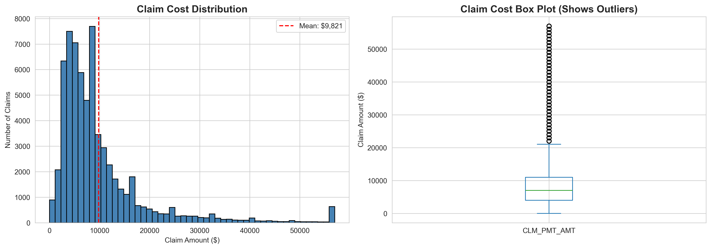
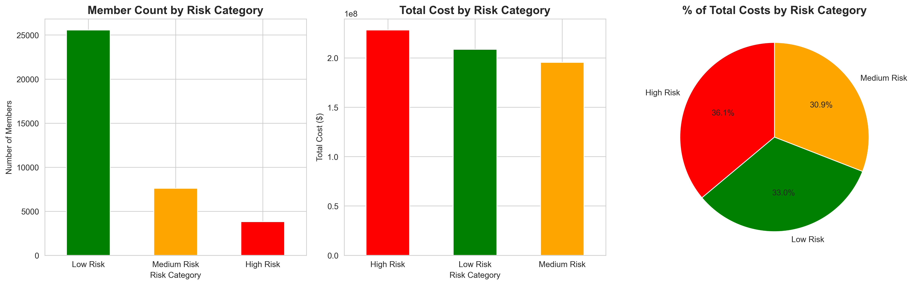
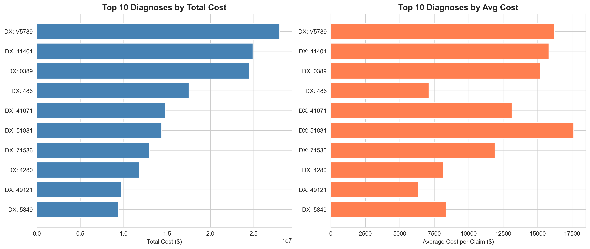
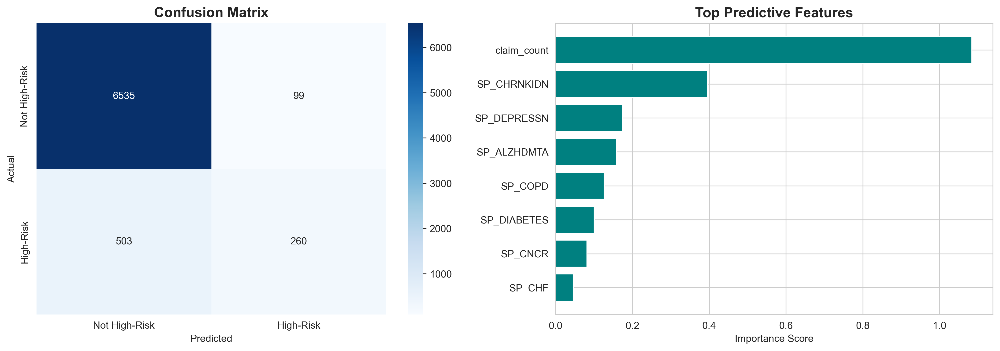

# 🏥 Healthcare Claims Analytics & Member Risk Segmentation

End-to-end Medicare claims analysis identifying high-cost members and cost drivers using CMS data, predictive modeling, and interactive Tableau dashboard.

## 🌐 Live Dashboard
**[View Interactive Tableau Dashboard](https://public.tableau.com/app/profile/suhitha.reddy.somu/viz/HealthcareClaimsAnalyticsDashboard/Story1?publish=yes)**

Click to explore the live dashboard with interactive filters and animations!

---

## 🎯 Project Overview

Analyzed 850,000+ Medicare claims (64K inpatient, 792K outpatient) from CMS DE-SynPUF to:
- Identify high-cost members driving healthcare spending
- Segment members by risk level (Low/Medium/High)
- Predict future high-cost members using machine learning
- Provide actionable recommendations for cost reduction

### Key Finding
**Top 10% of members drive 36% of total healthcare costs** ($228M out of $632M)

---

## 📊 Business Impact

**Recommendations & Projected Savings:**
- **Case Management:** Target 3,814 high-risk members → Est. $34M savings (15% reduction)
- **Chronic Disease Programs:** 8,737 members with 3+ conditions → Reduce complications
- **Readmission Prevention:** 14,473 members with multiple admissions → $58M potential savings
- **Predictive Analytics:** Deploy ML model (92% accuracy) for early intervention

**Total Estimated Annual Impact:** $92M+ in cost reduction opportunities

---

## 📁 Repository Contents
```
healthcare-claims-analysis/
├── healthcare_claims_analysis.ipynb    # Complete analysis workflow
├── healthcare_claims_queries.sql       # 10 business SQL queries
├── hedis_compliance_report.txt         # HEDIS/CMS-style compliance report
├── healthcare_claims_report.txt        # Executive summary
├── claim_cost_distribution.png         # Cost analysis visualization
├── risk_segmentation.png               # Member risk categories
├── top_diagnoses.png                   # Top cost-driving conditions
├── predictive_model.png                # ML model performance
└── README.md                           # Project documentation
```

---

## 🔬 Methodology

### Data Source
- **CMS DE-SynPUF** (Synthetic Medicare Claims Data)
- **Period:** 2008-2010
- **Original Dataset:** 112,845 beneficiaries, 856,941 total claims

### Data Cleaning
Removed 3.2% of inpatient claims due to:
- $0 payment amounts (can't analyze cost drivers without costs)
- Missing admission dates (needed for time-based analysis)
- Missing diagnosis codes (essential for condition identification)

**Final Dataset:** 64,379 inpatient claims across 36,981 unique members

### Analysis Approach

**1. Cost Analysis**
- Claim-level: Average $9,821 per inpatient claim
- Member-level: Average $17,098 per member annually
- Range: $10 to $264,000 (one member with 12 hospitalizations)

**2. Risk Segmentation**
Created three-tier model based on total annual costs:
- **Low Risk (<$18K):** 25,558 members (69%) → 33% of costs
- **Medium Risk ($18K-$39K):** 7,609 members (21%) → 31% of costs  
- **High Risk (>$39K):** 3,814 members (10%) → 36% of costs

**3. Predictive Modeling**
- **Algorithm:** Logistic Regression
- **Accuracy:** 91.9%
- **Top Predictors:** Number of claims, chronic kidney disease, depression
- **Use Case:** Identify at-risk members before they become high-cost

**4. Diagnosis Analysis**
- ICD-9 diagnostic codes analyzed
- Top 10 conditions account for $165M in costs
- Chronic conditions increase costs by 18.8%

---

## 💻 Technical Stack

- **Python 3.13:** Data analysis and modeling
- **Pandas, NumPy:** Data manipulation and aggregation
- **Scikit-learn:** Predictive modeling (Logistic Regression)
- **Matplotlib, Seaborn:** Data visualization
- **SQL:** Business query development
- **Tableau Public:** Interactive dashboard
- **Jupyter Notebook:** Analysis documentation

---

## 📊 Key Insights

### Cost Distribution
- **Utilization:** Average 1.7 claims per member
- **High Utilizers:** 8.7% of members have 4+ claims
- **Cost Drivers:** Inpatient claims are 34.5x more expensive than outpatient ($9,821 vs $285)

### Chronic Conditions Impact
- Members with 0 conditions: $14,705 average cost
- Members with 8 conditions: $35,031 average cost (2.4x higher)
- 18.8% cost increase associated with chronic conditions

### Readmission Patterns
- 39% of members had 2+ admissions (readmission indicator)
- Above industry benchmark (14-16%)
- Prime target for intervention programs

---

## 🔍 SQL Queries

Developed 10 business SQL queries covering:
- High-cost member identification
- Risk segmentation logic
- Top cost-driving diagnoses
- Chronic condition impact analysis
- Readmission risk identification
- Cost per member per month (PMPM) calculations

**[View SQL Queries](healthcare_claims_queries.sql)**

---

## 📋 Compliance Reporting

Created HEDIS/CMS-aligned quality metrics report including:
- Population overview and cost metrics
- Utilization metrics (admits per 1,000, readmission rates)
- Chronic disease prevalence
- Risk stratification analysis
- Actionable recommendations

**[View Compliance Report](hedis_compliance_report.txt)**

---

## 🚀 How to Run

### Prerequisites
```bash
Python 3.13+
pandas
numpy
scikit-learn
matplotlib
seaborn
jupyter
```

### Installation
```bash
git clone https://github.com/Suhithasomu/healthcare-claims-analysis.git
cd healthcare-claims-analysis
pip install pandas numpy scikit-learn matplotlib seaborn jupyter
```

### Data Setup
1. Download CMS DE-SynPUF data from [CMS Website](https://www.cms.gov/data-research/statistics-trends-and-reports/medicare-claims-synthetic-public-use-files)
2. Extract CSV files to `data/` folder
3. Required files:
   - `DE1_0_2010_Beneficiary_Summary_File_Sample_2.csv`
   - `DE1_0_2008_to_2010_Inpatient_Claims_Sample_2.csv`
   - `DE1_0_2008_to_2010_Outpatient_Claims_Sample_2.csv`

### Run Analysis
```bash
jupyter notebook healthcare_claims_analysis.ipynb
```

---

## 📈 Visualizations

### Cost Distribution


### Risk Segmentation


### Top Diagnoses


### Predictive Model Performance


---

## 💡 Key Learnings

1. **Data Quality Matters:** 3.2% of claims had issues - cleaning decisions directly impact analysis credibility
2. **Pareto Principle in Healthcare:** 10% of members drive 36% of costs - focus interventions here
3. **Chronic Conditions Are Costly:** Members with 3+ conditions have significantly higher costs
4. **Predictive Models Enable Proactive Care:** 92% accuracy allows early intervention before costs escalate
5. **Claims vs. Utilization:** Number of claims is the #1 predictor of high cost (more important than demographics)

---

## 🔮 Future Enhancements

- **Pharmacy Claims Integration:** Add prescription data for comprehensive cost picture
- **Readmission Analysis:** Calculate actual 30-day readmission rates with admission dates
- **Geographic Analysis:** Cost variation by state/region
- **Provider Analysis:** Identify high-cost providers and practice patterns
- **Time Series Forecasting:** Predict future cost trends
- **Real-time Dashboard:** Deploy as web application with auto-updating data

---

## 👤 Author

**Suhitha Reddy Somu**  
Data Analyst | Dallas, TX  

📧 suhithasomu0108@gmail.com  
💼 [LinkedIn](https://www.linkedin.com/in/suhitha-reddy-somu)  
💻 [GitHub](https://github.com/Suhithasomu)  
📊 [Tableau Public](https://public.tableau.com/app/profile/suhitha.reddy.somu)

---

## 📄 License

This project uses publicly available CMS DE-SynPUF data. The data is synthetic and does not contain real patient information.

---

## 🙏 Acknowledgments

- **Data Source:** CMS (Centers for Medicare & Medicaid Services)
- **Dataset:** DE-SynPUF - Synthetic Medicare Claims
- **Inspiration:** Real-world healthcare cost management challenges

---

*Built to demonstrate end-to-end healthcare analytics capabilities: data cleaning, SQL, Python, machine learning, business insights, and data visualization.*
